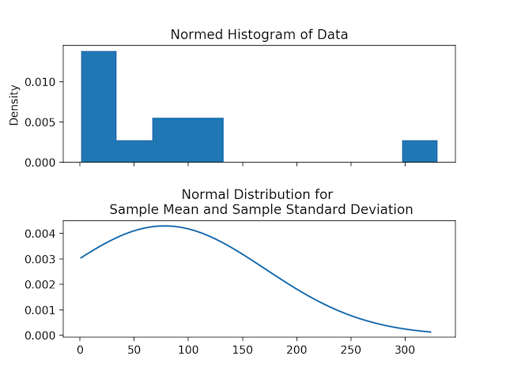

# Normal Distribution
## about
this package is for solving gaussian distribution and finds attributes of data like mean, standard diviation and probability density
## why?
i made this package as a practice of my software engineering skills and also to get practice of math required for machine learning and to get a full expericence of publishing a fully rounded project into people.

it was a great experence building this project.
## preinstallments
it requires matplotlib to be preinstall as this package is able to plot the probability distribution function and other plots with the help of matplotlib library.

## features
this package can read a text file containing the data and perform distribution functions and plot the distribution graph.

## installation
`pip install normal-distribution` or you can also clone [github repo](https://github.com/kishoreKunisetty/normal_distribution) and run `pip install .` in the terminal when the terminal is inside normal_distribution folder.
## understanding
this is a tree disgram of functions used given for better understanding of this package.
```
Distribution
|-init()
|-read_data_file()
|-Gaussian
|   |-init()
|   |-calculate_mean()
|   |-calculate_stdev()
|   |-plot_histogram()
|   |-pdf()
|   |-plot_histogram_pdf()
|
|-Binomial
    |-init()
    |-calculate_mean()
    |-calculate_stdev()
    |-replace_stats_with_data()
    |-plot_bar()
    |-pdf()
    |-plot_bar_pdf()
```
Distribution is super class of Gaussian and Binomial and called in both of them for its functionality of reading data from files.

**both class have thier magic methods(add, repr) modidied hence any number of Gaussian instances can be added or Binomial instances can be added but not Binomial with Gaussian.**

## how to use?
### Gaussian Distribution
importing and creating a gaussian 
```python
import normal_distribution as nd
gaussian = nd.Gaussian(25, 5)
gaussian
>>> mean 25, standard deviation 5
```
reading a data file in text format
```python
file_name = "file_location/file_name.txt"
gaussian.read_data_file(file_name)
```
calculating mean and standard deviation for the data.
```python
gaussian.calculate_mean()
gaussian.calculate_stdev()
```

plotting a histogram of the data
```
gaussian.plot_histogram()
```
>output


calculating probability distribution function(pdf)
```python
gaussian.pdf()
>>> {some float}
```

plotting pdf
```python
n_space = 5
gaussian.plot_histogram_pdf(n_space)
```
>output


### binomial Distribution
importing and creating Binomial
```python
import normal_distribution as nd
Binomial = nd.Binomial(0.5, 20) #prob = 0.5 and size = 20
Binomial
>>>mean 10.0, standard deviation 2.23606797749979, p 0.5, n 20
```
reading text file
```python
file = "file_location/file_name.txt"
Binomial.read_data_file(file)
```
calculating mean
```python
Binomial.calculate_mean()
>>> 10.0
```
calculating standard deviation
```python
Binomial.calculate_stdev()
>>>1.7541160386140584
```
replacing or initilizing data taken from file
```python
Binomial.replace_stats_with_data()
Binomial
>>>mean 8.0, standard deviation 1.7541160386140584, p 0.6153846153846154, n 13
```


## reference 
refer [github](https://github.com/kishoreKunisetty/normal_distribution) for mathematics behind this library 

